# 🛡️ python-ad-audit

**Pipeline complet d'audit Active Directory et de détection d'anomalies comportementales (UEBA) sur des sessions PAM**, avec data warehouse SQL, dashboard interactif Power BI/Streamlit, et agent IA explicatif.

Projet personnel construit en parallèle d'un stage sécurité/infrastructure au sein d'une banque, appliquant concrètement les notions vues en entreprise (Active Directory, PAM/Wallix, Qualys) sur un pipeline de données de bout en bout.


---

## 📋 Sommaire

- [Aperçu](#-aperçu)
- [Architecture](#-architecture)
- [Fonctionnalités par module](#-fonctionnalités-par-module)
  - [1. Audit Active Directory](#1-audit-active-directory)
  - [2. Détection d'anomalies UEBA](#2-détection-danomalies-ueba)
  - [3. Comparaison Isolation Forest vs LOF](#3-comparaison-isolation-forest-vs-lof)
  - [4. Géolocalisation des connexions](#4-géolocalisation-des-connexions)
  - [5. Agent IA explicatif](#5-agent-ia-explicatif)
  - [6. Data Warehouse & Power BI](#6-data-warehouse--power-bi)
- [Installation](#-installation)
- [Structure du projet](#-structure-du-projet)
- [Résultats clés](#-résultats-clés)
- [Limites connues](#-limites-connues)
- [Pistes d'amélioration](#-pistes-damélioration)

---

## 🎯 Aperçu

Ce projet simule un environnement bancaire (comptes AD, scans de vulnérabilités Qualys, sessions PAM Wallix) et applique une chaîne complète d'analyse sécurité :

`Génération de données` → `Audit & scoring de risque` → `Détection d'anomalies (ML non-supervisé)` → `Géolocalisation` → `Explication en langage naturel (IA)` → `Data warehouse & BI`

Toutes les données sont **fictives**, générées avec Faker — aucune donnée réelle de la banque n'est utilisée.

---

## 🏗️ Architecture

<!--
📷 CAPTURE À INSÉRER ICI : un schéma d'architecture (à créer si pas encore fait,
même simple : boîtes + flèches représentant le flux ci-dessus). Peut être fait
avec draw.io, excalidraw, ou généré en Python/matplotlib.
Nom suggéré : docs/screenshots/architecture_globale.png
-->
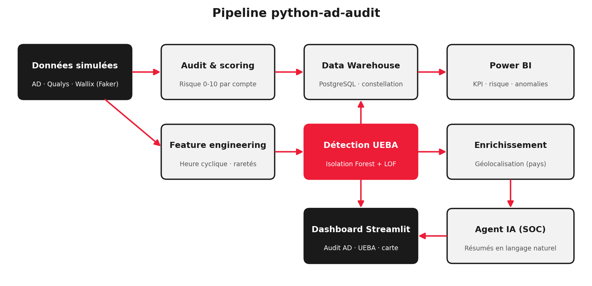

---

## 🧩 Fonctionnalités par module

### 1. Audit Active Directory

Génération de comptes AD fictifs (Faker), croisement avec des données de vulnérabilités Qualys simulées, calcul d'un score de risque (0-10) par compte, génération automatique de rapports PDF.

<!-- 📷 dashboard_audit_ad_kpi.png : vue d'ensemble avec KPI (comptes analysés, risque critique/élevé, score moyen) -->
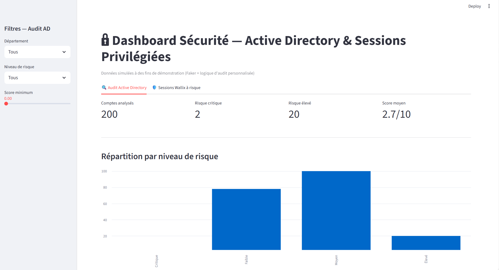

<!-- 📷 dashboard_audit_ad_detail.png : score de risque par département + tableau détaillé des comptes -->
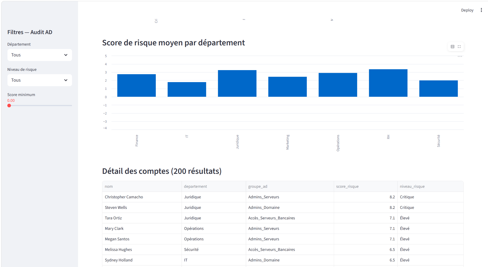

---

### 2. Détection d'anomalies UEBA

Simulation de sessions PAM Wallix avec profils comportementaux par entité (heure habituelle, assets fréquentés). Feature engineering (encodage cyclique de l'heure, score de rareté d'asset) et entraînement d'un modèle **Isolation Forest** non-supervisé.

<!-- 📷 dashboard_ueba_overview.png : onglet UEBA, vue d'ensemble (sessions totales/suspectes, taux de signalement) -->
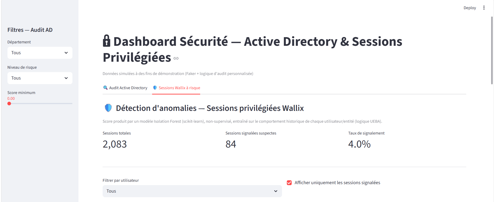

<!-- 📷 dashboard_ueba_sessions_suspectes.png : tableau détaillé des sessions signalées suspectes -->
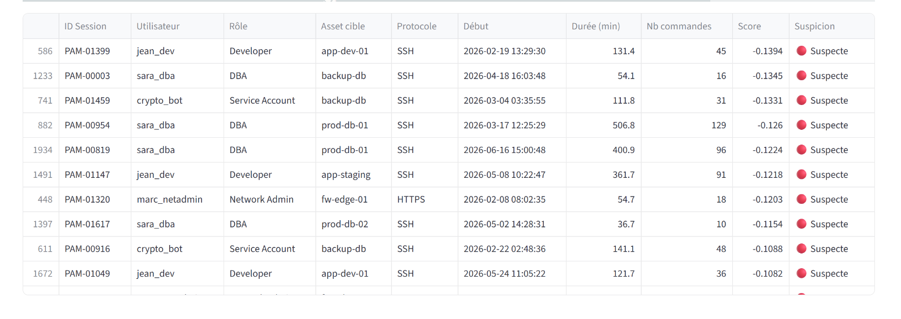

<!-- 📷 wallix_confusion_matrix.png : générée automatiquement par scripts/phase12_wallix_evaluation_main.py -->
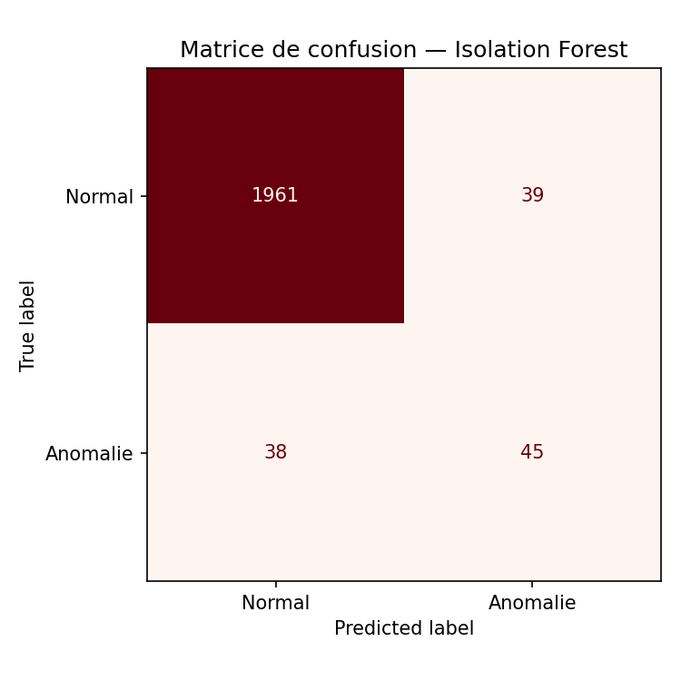

<!-- 📷 wallix_score_distribution.png : générée automatiquement par le même script -->
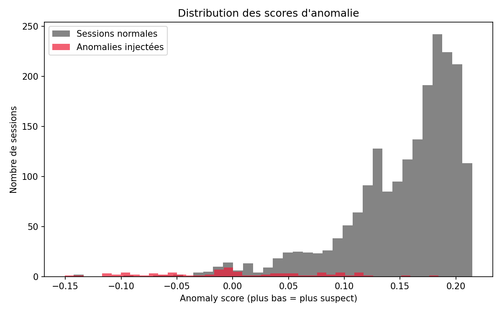

**Résultat** : precision 0.52, recall global 0.53 — bon sur `sensitive_command`/`unusual_duration` (~78-82%), plus faible sur les anomalies **contextuelles** `unusual_asset`/`unusual_hour` (~19-25%).

---

### 3. Comparaison Isolation Forest vs LOF

Ajout d'un second modèle, **Local Outlier Factor**, spécifiquement pour capter les anomalies contextuelles qu'Isolation Forest détecte mal. Comparaison rigoureuse des deux approches, avec normalisation des features (StandardScaler) — une étape indispensable pour LOF, contrairement à Isolation Forest.

<!-- 📷 wallix_lof_score_distribution.png : générée par scripts/phase14_lof_main.py -->
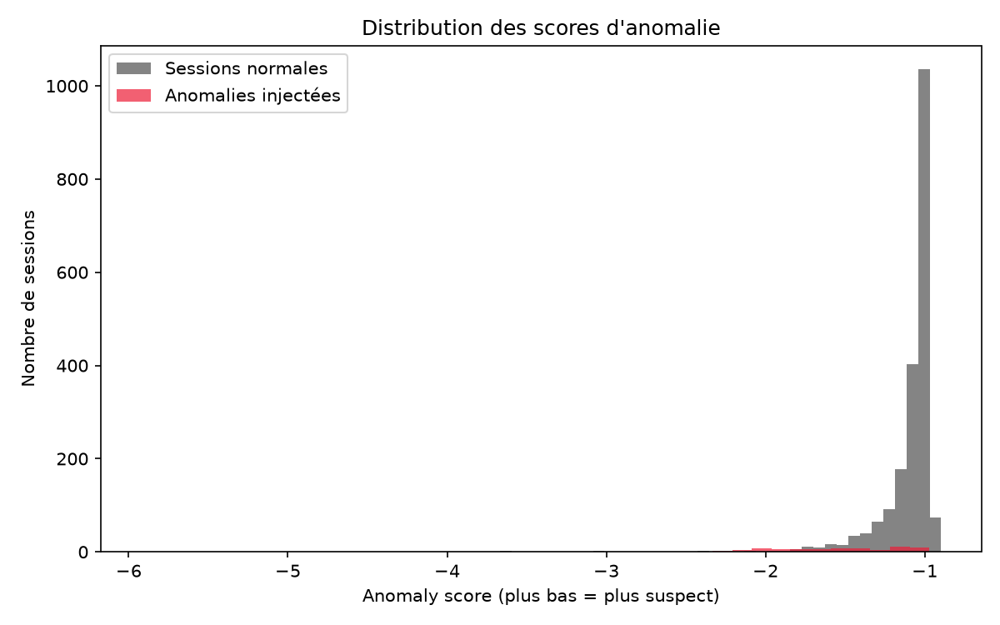

<!--
📷 Graphique comparatif recall LOF vs Isolation Forest par type d'anomalie
(généré pendant la Phase 14 — à extraire du rapport PDF de synthèse, ou à
régénérer en sauvegardant la figure matplotlib directement en PNG à côté du PDF)
Nom suggéré : docs/screenshots/comparison_recall_lof_vs_isoforest.png
-->
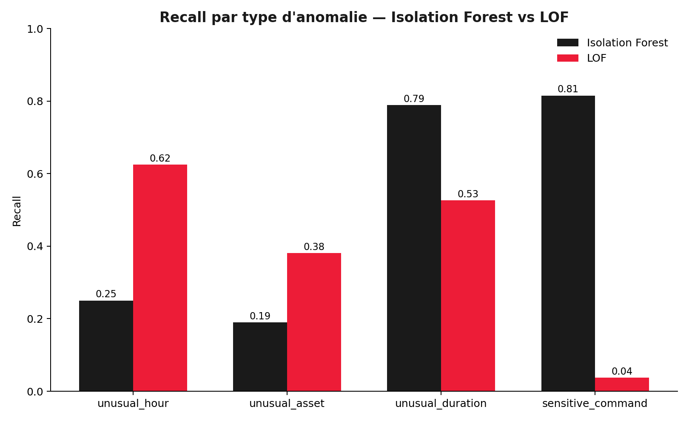

| Type d'anomalie | Isolation Forest | LOF |
|---|---|---|
| GLOBAL | 0.542 | 0.349 → 0.470* |
| unusual_hour | 0.250 | **0.625** |
| unusual_asset | 0.190 | **0.381** |
| unusual_duration | **0.789** | 0.526 |
| sensitive_command | **0.815** | 0.037 |
| unusual_country | 0.60 | 0.45 |

*\*avec ajout de la feature `country_rarity_score` (Phase 15)*

**Conclusion** : les deux modèles sont complémentaires, pas concurrents — LOF excelle sur les anomalies contextuelles, Isolation Forest sur les signaux globaux/catégoriels nets.

---

### 4. Géolocalisation des connexions

Simulation d'un pays de connexion par session (pays habituel par profil + injection de connexions depuis des pays inhabituels), avec carte interactive.

<!-- 📷 dashboard_geoip_carte.png : carte st.map() avec points normaux (noir) et anomalies (rouge) -->
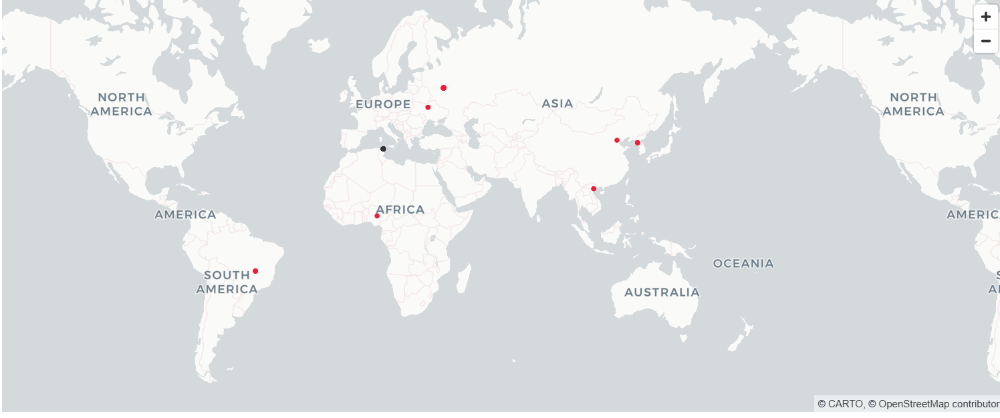

---

### 5. Agent IA explicatif

Un "assistant SOC" qui génère un résumé en langage naturel d'une session suspecte sélectionnée manuellement, via l'API Groq (modèle Llama 3.3 70B).

<!-- 📷 dashboard_agent_ia_soc.png : note d'analyse SOC générée par l'IA -->
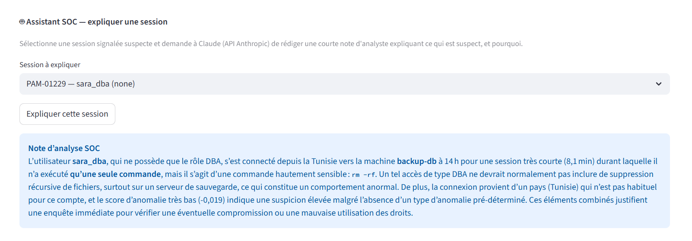

---

### 6. Data Warehouse & Power BI

Modélisation en schéma en constellation (2 tables de faits, 4 dimensions) sous PostgreSQL, alimentée par un pipeline ETL Python, avec dashboard Power BI (KPI, répartition par type d'anomalie, risque par département, tableau détaillé).

<!-- 📷 powerbi_schema_relations.png : schéma des relations entre tables de faits/dimensions -->
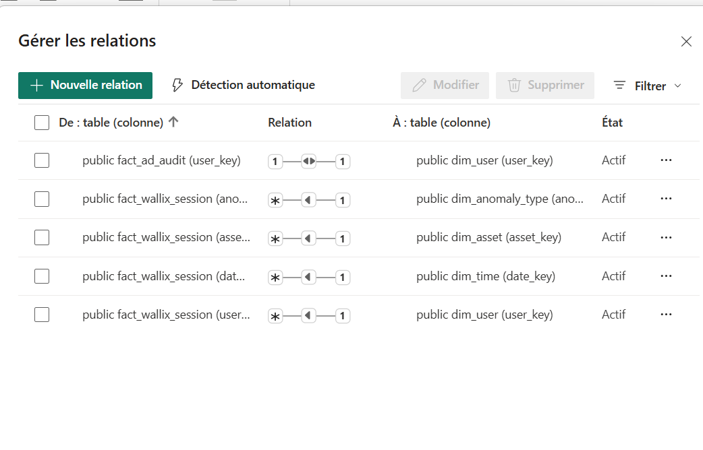

<!-- 📷 powerbi_dashboard_complet_v2.png : dashboard Power BI complet (version finale) -->
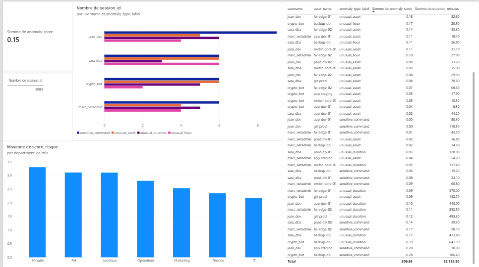

---

## ⚙️ Installation

```bash
git clone https://github.com/RSassi22/python-ad-audit.git
cd python-ad-audit
pip install -r requirements.txt
cp .env.example .env   # renseigner GROQ_API_KEY et les identifiants PostgreSQL
```

## 🚀 Lancer le projet

```bash
# Génération des données (audit AD)
python scripts/phase1_generate_data_main.py

# Génération des sessions Wallix + entraînement des modèles
python scripts/phase9_wallix_main.py
python scripts/phase10_wallix_features_main.py
python scripts/phase11_wallix_model_main.py
python scripts/phase14_lof_main.py

# Dashboard
streamlit run dashboard.py
```

## 📁 Structure du projet

```
python-ad-audit/
├── core/
│   ├── sources.py              # Génération données AD/Qualys
│   ├── audit.py                # Moteur d'audit
│   ├── scoring.py               # Scoring de risque
│   ├── wallix_sources.py       # Simulation sessions PAM + géo
│   ├── wallix_features.py      # Feature engineering UEBA
│   ├── wallix_model.py         # Isolation Forest
│   ├── wallix_lof_model.py     # Local Outlier Factor
│   ├── wallix_evaluation.py    # Évaluation & visualisations
│   ├── wallix_agent.py         # Agent IA explicatif (Groq)
│   ├── wallix_dashboard.py     # Dashboard Streamlit
│   └── db.py                    # ETL PostgreSQL
├── scripts/                     # Scripts d'orchestration par phase
├── data/                        # Données générées (CSV)
├── docs/screenshots/            # Captures & graphiques générés
└── dashboard.py                  # Point d'entrée Streamlit
```

## 📊 Résultats clés

- **2 083 sessions PAM** simulées, 4% d'anomalies injectées
- **2 modèles ML non-supervisés** comparés (Isolation Forest, LOF) avec analyse critique par type d'anomalie
- **Data leakage évité** à chaque étape : les labels ne sont jamais vus par les modèles pendant l'entraînement

## ⚠️ Limites connues

- Coordonnées géographiques fixes par pays (pas de vraie géolocalisation IP)
- Dataset simulé — les résultats ne se transposent pas directement à un environnement de production
- LOF sensible au choix de `n_neighbors`, non optimisé par recherche d'hyperparamètres

## 🔭 Pistes d'amélioration

- Modèle combiné (fusion Isolation Forest + LOF)
- Alerting Slack/Teams en temps réel
- Graphe réseau utilisateur ↔ asset
- Cartographie MITRE ATT&CK sur les commandes sensibles

---

*Projet réalisé à titre personnel, données entièrement fictives.*